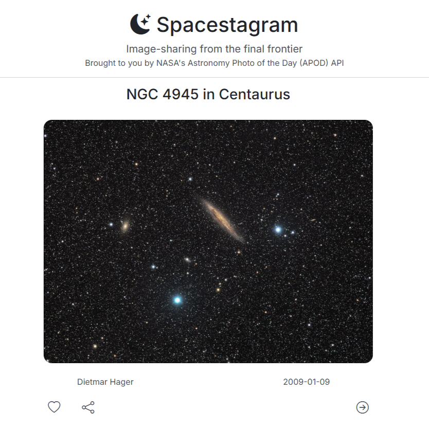
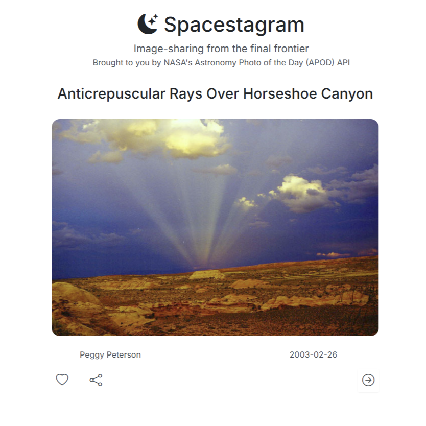
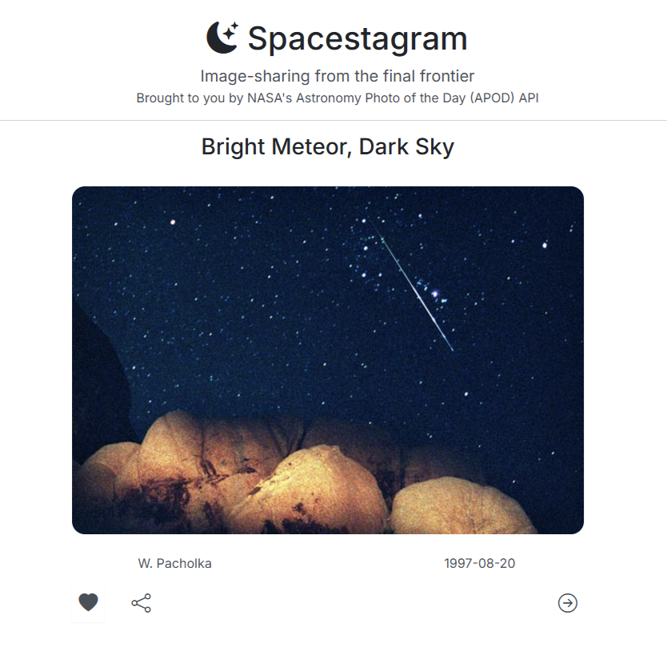
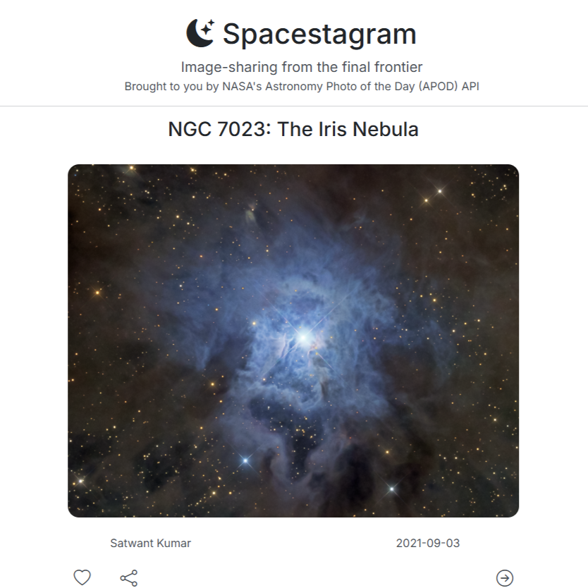

# Spacestagram

Image-sharing from the final frontier

## About

Spacestagram is a React web application for viewing and sharing images of space. Data is fetched from NASA's Open [API](https://api.nasa.gov/) and displayed on the front-end with the help of [Bootstrap](https://getbootstrap.com/).

Project is hosted using GitHub Pages and can be accessed [here](https://thaiduongvu.github.io/spacestagram/).

Optionally you can run the project locally with these steps:

1. Clone the project.
2. Open a terminal and navigate to the project directory.
3. Run `npm install`.
4. Run `npm start`.

## Features

Overview of key features:

1. Image viewing
2. Image liking
3. Image shuffling
4. Image sharing using URL
5. Mobile-friendly responsive design

## Screenshots

